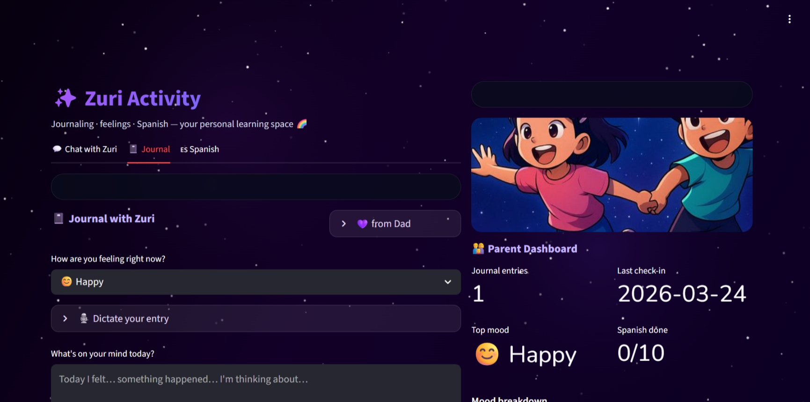
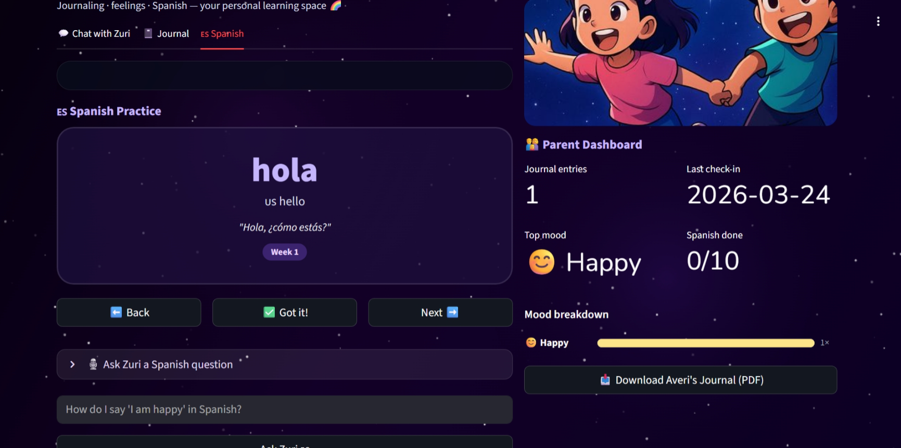
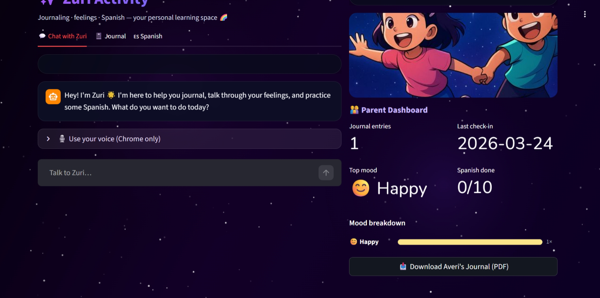
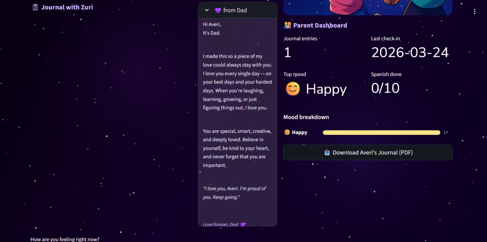

## Screenshots / Demo

## Live Demo
[Open ZuriCare Live](https://zuri-activity.replit.app)

### Chat View

### Spanish Practice

### Journal View

### Parent Dashboard

## Tech Stack
- Frontend: HTML, CSS, JavaScript
- Backend: JavaScript app logic
- Database: Firebase Firestore (cloud sync for journal entries)
- Auth: None
- Hosting: Replit
- APIs: Browser speech features and app-integrated learning flows

## How It Works
1. Child opens the app and interacts with Zuri
2. Zuri guides learning, journaling, and mood reflection
3. Journal activity is saved to Firebase Firestore
4. Parent dashboard shows progress and trends

## Setup Instructions
1. Clone the repository
2. Open the project in Replit or your local editor
3. Add your Firebase configuration
4. Run the app
5. Test journaling, Spanish practice, and dashboard views

## Notes
- ZuriCare is designed as a child-safe, parent-aware experience focused on growth, encouragement, and learning.
- The current version uses Firebase Firestore for cloud-synced journal storage.
- Authentication and account-based access are not yet implemented because this version is designed for a private parent-child use case.
- The live prototype is currently deployed under the working title "Zuri Activity."
